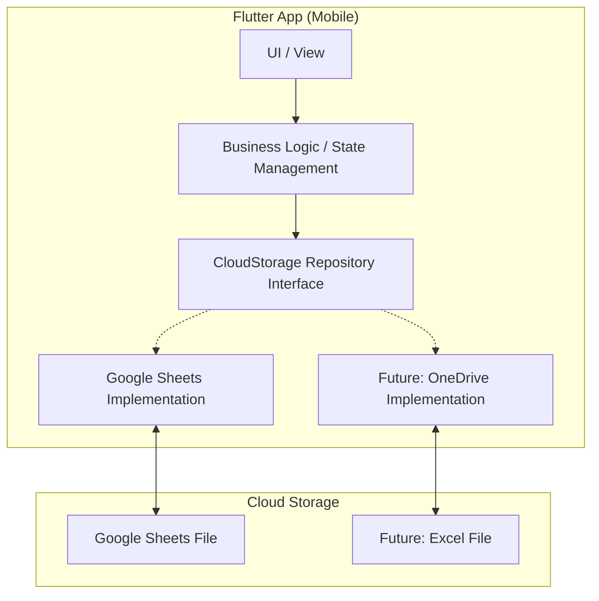

# アプリ仕様書: its-none (メモ同期アプリ)

## 1. 概要
本アプリは、Android/iOS端末から入力した予定データをクラウド上のスプレッドシート（Google Sheets/Excel）と同期するメモアプリです。
データの永続化において、既存データの「上書き」ではなく「新規シートの追加」を行うことで、変更履歴の保持と確実なデータ反映を実現します。

## 2. システム構成
将来的なクラウドストレージの変更（OneDrive等への対応）を容易にするため、データアクセス層を抽象化したアーキテクチャを採用します。

### 2.1. アーキテクチャ図

### 2.2. 技術スタック
- **Frontend**: Flutter
- **Language**: Dart
- **Authentication**: Google Sign-in (Firebase Auth or google_sign_in package)
- **API**: Google Sheets API v4 / Google Drive API v3
- **Local Storage**: sqflite or shared_preferences (設定・キャッシュ用)

## 3. 主要機能仕様

### 3.1. 予定入力とクラウド反映
- ユーザーは日付を選択し、メモ（予定）を入力する。
- 保存実行時、以下の処理を行う。
    1. 指定されたスプレッドシートを開く。
    2. **新しいシート（タブ）を追加**する。シート名は `YYYYMMDD_HHMMSS` 形式とする。
    3. 新しいシートに入力データを書き込む。

### 3.2. クラウドからの同期
- クラウド上の最新データを端末側に反映させる。
- 同期ロジック：
    1. スプレッドシート内の全シート名を取得。
    2. 名前のソート順で「最新（最後）」のシートを特定。
    3. そのシートからデータを読み取り、アプリ内の表示を更新する。

## 4. データ構造

### 4.1. スプレッドシート構成
- **ファイル名**: `its-none-data` (仮)
- **シート構成**: 
    - 1回の同記（書き込み）ごとに1シート追加。
    - 各シート内のデータ形式（例）：
        | A列 (Item) | B列 (Value) |
        | :--- | :--- |
        | Date | 2026/04/15 |
        | Content | 打ち合わせ |
        | ... | ... |

## 5. 将来の拡張性（OneDrive対応）に関する設計
- `CloudStorageRepository` のインターフェースを定義し、具体的なAPIコール（HTTPリクエスト等）を実装クラスに隠蔽する。
- OneDrive対応時には、Microsoft Graph API を使用する `OneDriveRepository` を作成し、DI（依存性の注入）によって切り替え可能とする。

## 6. 開発環境
- Docker / devcontainer
- Flutter SDK
- Google Cloud SDK (認証・API設定用)
